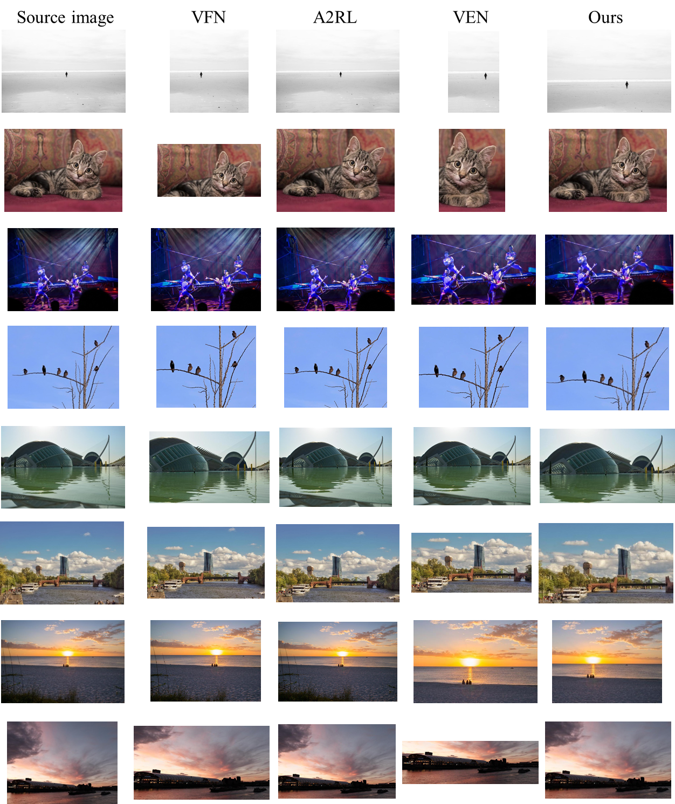
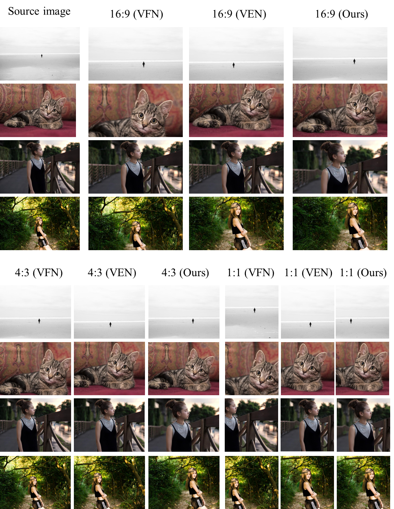
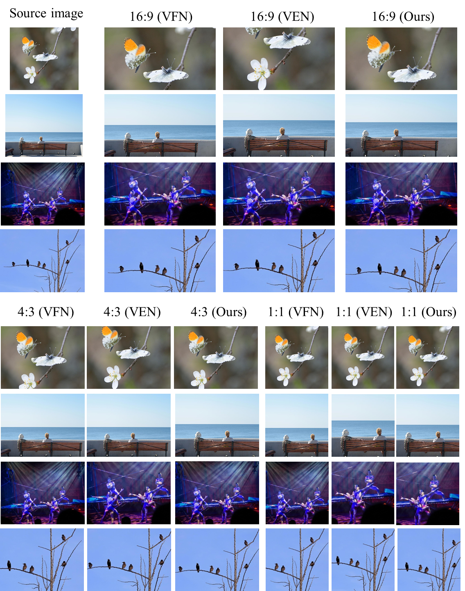
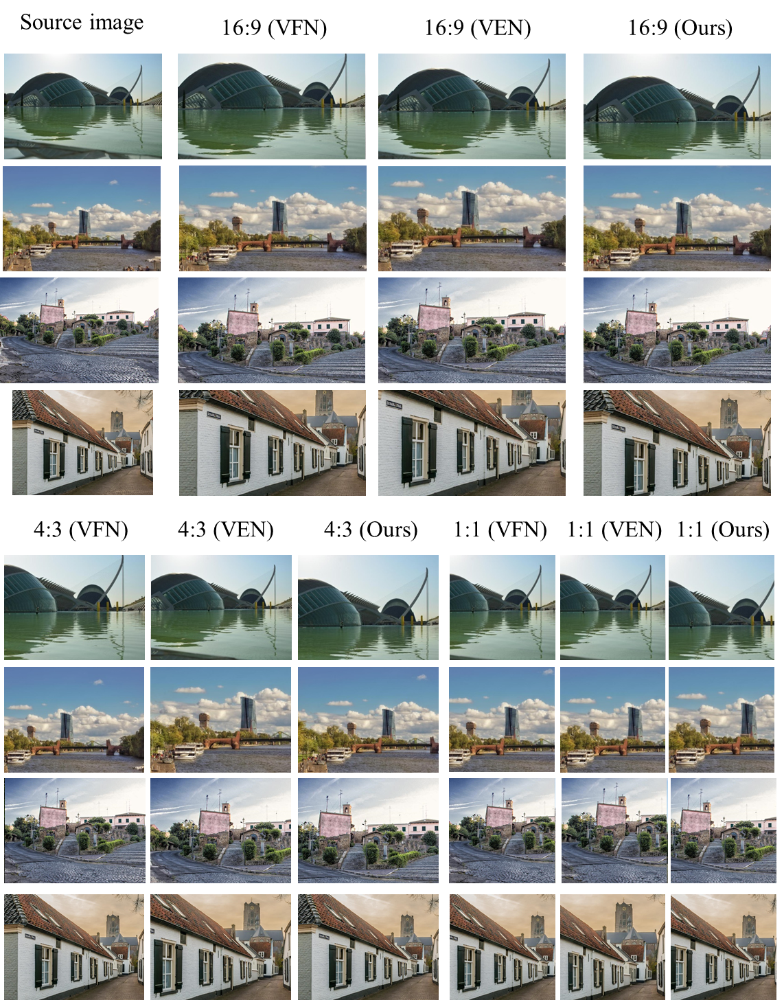
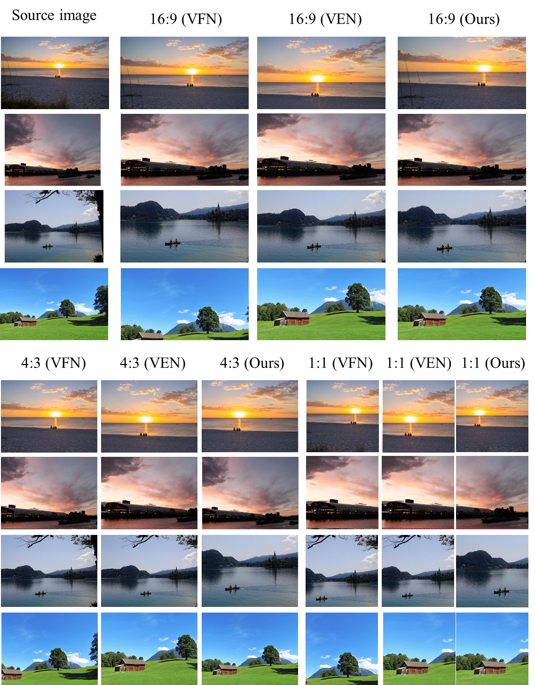

# Grid-Anchor-based-Image-Cropping

### Notification
We recently found an implementation bug in calcualating the Acc indexes which were slightly different from the definition in our paper. Fortunately, this bug does not affect any of the conclusions in our paper. We have corrected this bug in the Matlab code and updated the corresponding values in the revised paper using blue-color font. We apologize for the confusion to readers. The detailed changes in code can be found in this issue [#9](https://github.com/HuiZeng/Grid-Anchor-based-Image-Cropping/issues/9).

### Material
### [Paper](https://drive.google.com/file/d/1q9jxaJEn2AhEgQEUKHOgGCPQtHRuGNO3/view?usp=sharing), [Supplementary](https://drive.google.com/open?id=154BHBSzl-C9tP-5Gvjcf6GJmNCVv6X-l), [Dataset](https://drive.google.com/open?id=1KhmyjoimsQVXqPnLjKZiU4iXNKNyyxqW), [Model](https://drive.google.com/open?id=1OvLT_ul17zCK4ljAi4myGAgA50PmLy3Y)，[PCT Patent].

#### A pytorch evaluation code can be downloaded [here](https://drive.google.com/open?id=1owO_je8fHyiEHeZFup2EqxgxvoeYWBPq), which may obtain slightly different results of the Matlab version.

The pytorch code was last updated at 2019/5/5 with bugs fixed.

### Citation
```
@inproceedings{zhang2019deep,
  title={Reliable and Efficient Image Cropping: A Grid Anchor based Approach},
  author={Zeng, Hui, Li, Lida， Cao, Zisheng and Zhang, Lei},
  booktitle={IEEE Conference on Computer Vision and Pattern Recognition},
  year={2019}
}
```
### Abstract
Image cropping aims to improve the composition as well as aesthetic quality of an image by removing extraneous content from it. Existing image cropping databases provide only one or several human-annotated bounding boxes as the groundtruth, which cannot reflect the non-uniqueness and flexibility of image cropping in practice. The employed evaluation metrics such as intersection-over-union cannot reliably reflect the real performance of cropping models, either. This work revisits the problem of image cropping, and presents a grid anchor based formulation by considering the special properties and requirements (e.g., local redundancy, content preservation, aspect ratio) of image cropping. Our formulation reduces the searching space of candidate crops from millions to less than one hundred. Consequently, a grid anchor based cropping benchmark is constructed, where all crops of each image are annotated and more reliable evaluation metrics are defined. We also design an effective and lightweight network module, which simultaneously considers the region of interest and region of discard for more accurate image cropping. Our model can stably output visually pleasing crops for images of different scenes and run at a speed of 125 FPS.

### How to run the Code
1. Download the [MatConvNet](http://www.vlfeat.org/matconvnet/) into ``tools`` and Compile it according to the guidence therein. 

2. Create a new folder ``pretrained_models`` and download the pre-trained [vgg16](http://www.vlfeat.org/matconvnet/models/imagenet-vgg-verydeep-16.mat) or [ResNet50](http://www.vlfeat.org/matconvnet/models/imagenet-resnet-50-dag.mat) into ``pretrained_models``. This is  unnecessary for evaluation.

3. Create a new folder ``dataset``and download our GAIC dataset into it. This is  unnecessary for evaluation.

For training and testing on the GAIC:

Run the main function `RunExperiment.m`.

For evaluation:

Run `testGAIC_qualitative.m` or `testGAIC_qualitative_customer.m`. For evulation, you need to download our [model](https://drive.google.com/open?id=1OvLT_ul17zCK4ljAi4myGAgA50PmLy3Y)  into the folder ``pretrained_models``.


### Results
Qualitative comparison of returned top-1 crop by different methods. Each model uses its default candidate crops generated by its source code except for VFN, which does not provide such code and uses the same candidates as our method.
 

Qualitative comparison of returning crops with different aspect ratios by different methods. All models use the same candidate crops.
 

 

 

 

#### Notification
1. The released model is re-trained and slightly different from the the one used in our paper.
2. The running speed (125 FPS) is calculated without considering the pre-processing of image, for fair comparison with previous work (the VPN).

